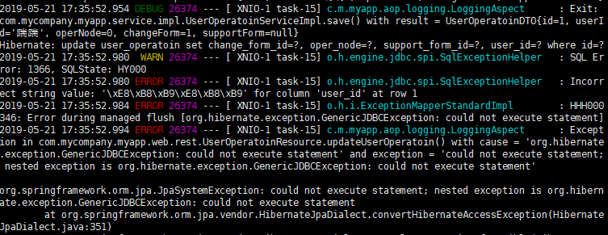

# 学习在Centos上使用JHipster

warning：注意，不能安装最新版本的java，建议安装java-open-8
[知乎专栏](https://zhuanlan.zhihu.com/c_1008296180270391296)<br/>
[腾讯云雅俗](https://cloud.tencent.com/developer/column/2477)<br/>
[腾讯云导师](https://cloud.tencent.com/developer/column/72948)
[]()

#### 配置环境
首先需要安装Centos虚拟机（root需要设置密码）
之后配置DHPC网络，查看虚拟机网卡接口，以及VMware的NAT网口和ip地址范围
* ```vi /etc/sysconfig/network-scripts/ifcfg-xxx(看具体连接名称)```
* 修改```ONBOOT = yes, BOOTPROTO=dhcp```
* /etc/resolv.conf中nameserver应该与网口对应
* service network restart

之后按照如下教程进行安装：
[在Centos7下安装JHipster](https://segmentfault.com/a/1190000017133346)<br/>
其中yarn路径设置有问题，需要改成```export PATH=$PATH:/usr/local/yarn/yarn-v1.12.0/bin```

注意：<br/>
在公司内网下安装需要设置代理，如http://proxy.tencent.com:8080<br/>
目前已知需要设置yum，wget，npm，yarn，maven等。<br/>
其中wget设置需要-Y on（使用代理）

> CentOS 7
NPM设置<br/>
$ npm config set proxy http://proxy.tencent.com:8080<br/>
$ npm config set https-proxy https://proxy.tencent.com:8080<br/>
设置registry<br/>
$ npm config set registry https://registry.npm.taobao.org/<br/>
Yarn设置<br/>
$ yarn config set proxy http://proxy.tencent.com:8080<br/>
$ yarn config set https-proxy https://proxy.tencent.com:8080<br/>
Git设置<br/>
$ git config --global http.proxy http://proxy.tencent.com:8080<br/>
$ git config --global https.proxy https://proxy.tencent.com:8080<br/>
Maven设置<br/>
$ vi ~/.m2/settings.xml<br/>
添加如下设置<br/>


```xml
<proxies>
    <proxy>
        <id>id</id>
        <active>true</active>
        <protocol>http</protocol>
        <username></username>
        <password></password>
        <host>proxy.tencent.com</host>
        <port>8080</port>
        <nonProxyHosts></nonProxyHosts>
    </proxy>
</proxies>
<br/>
```

Windows10 CMD<br/>
$ set http_proxy=http://proxy.tencent.com:8080

$ wget设置<br/>
vi /etc/wgetrc 修改proxy，user_proxy=on

其它设置同上。<br/>
修改/etc/yum.conf```proxy=http://xxx.xxx.xxx:xxxx ```


yarn config set strict-ssl false<br/>
npm config set strict-ssl false<br/>
npm 只需要设置http 不需要设置https 还要取消严格ssl，这样才能安装（为什么不能走https协议？？）<br/>
ping的时候只要有网址就可，不需要手动输入http协议<br/>

[centos7 mysql数据库安装和配置](https://www.cnblogs.com/starof/p/4680083.html)<br/>
[vi命令](http://man.linuxde.net/vi)<br/>
[Centos防火墙设置与端口开放的方法](https://blog.csdn.net/u011846257/article/details/54707864)<br/>

不生成dev无法运行，会产生proxy映射错误，因而无法使用登录注册等功能。

#### 优化开发环境
通过使用SecureFX和XShell可以分别实现在win和Centos中自由传输文件，以及多个窗口敲命令行，十分的爽，仿佛从未开化的元谋人成长为了宇宙人。

# 创建monoapp

详情可以参考导师blog[JHipster生成单体架构的应用示例](https://cloud.tencent.com/developer/article/1360212)

#### 创建实体
[官方文档](https://www.jhipster.tech/creating-an-entity/)<br/>
[中文翻译](http://jefferlau.me/2017/06/13/JHipster-%E5%AD%A6%E4%B9%A0%E7%AC%94%E8%AE%B0-6-%E5%88%9B%E5%BB%BA-entity/)<br/>
[jdl在线工具官方文档](https://www.jhipster.tech//jdl/)<br/>
jhipster import-jdl your-jdl-file.jh 从 JDL 文件生成实体。


# 学习Liquibase在SpringBoot上使用

[liquibase官方文档](https://www.liquibase.org/)
#### 为什么需要数据库管理工具

* 从迁移脚本中创建新的数据库
* 检查数据库状态
* 从一个版本快速到达另外一个版本

主流的Java生态圈，支持Spring Boot的有Flyway和Liquibase。
1. Flyway将SQL语句保存为文件，放入应用中执行即可（数据库之间可能不兼容，如h2和MySQL）
2. Liquibase支持xml、json、yaml、sql四种格式（可以根据数据库再生成，简单支持回滚）

接下来通过[IBM Developer的文章](https://www.ibm.com/developerworks/cn/java/j-ap08058/index.html)对Liquibase进行学习。<br/>

【学了一段时间之后】怎么感觉，并不能直接通过liquibase来更改项目的service层等，可以通过jhipster entity来实现这个操作，而liquibase更适用于做数据持久化之类。
#### 概念
DDL（Data Definition Language）数据库结构定义语言<br/>
DML（Date xxx Language）数据定义语言<br/>
[详见 SQL四种语言DDL DML DCL TCL](https://www.jb51.net/article/89030.htm)<br/>
把通过ddl脚本变更数据库结构称为数据库变更，把通过dml脚本变更数据库称为数据变更。

#### 创建一个变更日志和变更集
1. 创建一个XML文件（数据库变更日志），在LiquiBase XML里定义一个变更集
   
```XML
<?xml version="1.0" encoding="UTF-8"?> 
 
<databaseChangeLogxmlns="http://www.liquibase.org/xml/ns/dbchangelog/1.7"
 xmlns:xsi="http://www.w3.org/2001/XMLSchema-instance"
 xsi:schemaLocation="http://www.liquibase.org/xml/ns/dbchangelog/1.7 
        http://www.liquibase.org/xml/ns/dbchangelog/dbchangelog-1.7.xsd"> 
 <changeSet id="2" author="paul"> 
   <createTable tableName="brewer"> 
     <column name="id" type="int"> 
       <constraints primaryKey="true" nullable="false"/> 
     </column> 
     <column name="name" type="varchar(255)"> 
       <constraints nullable="false"/> 
     </column> 
     <column name="active" type="boolean" defaultValue="1"/> 
   </createTable> 
 </changeSet> 
</databaseChangeLog>
```  

需要一个XML模式引用（dbchangeLog-1.7.xsd）<br/>
Change Set是Liquibase的追蹤change執行的單位。ChangeSet使用author，id及changelog file的claspath(or filepath)路徑來做唯一識別。當Liquibase運行時，會從DATABASECHAGNELOG資料表查詢標記為已執行的changeSet並與chagelog中的changeSet進行比對，然後執行changelog file中尚未被執行的changeSets。


1. 从命令行运行LiquiBase

```
liquibase --driver=org.apache.derby.jdbc.EmbeddedDriver \  #数据库驱动器？？
--classpath=derby.jar \                                    #数据库驱动器Jar文件所在类路径
--changeLogFile=database.changelog.xml\                    #变更日志
--url=jdbc:derby:brewery;create=true \                     #数据库连接url
--username= --password= \                                  #用户名和密码
update                                                     #应用变更
```

也可以通过Ant脚本进行，把数据库变更作为自动化构建的一部分

```Ant
<target name="update-database"> 
 <taskdef name="updateDatabase" classname="liquibase.ant.DatabaseUpdateTask"
   classpathref="project.class.path" /> 
 <updateDatabase changeLogFile="database.changelog.xml"
   driver="org.apache.derby.jdbc.EmbeddedDriver"
   url="jdbc:derby:brewery"
   username=""
   password=""
   dropFirst="true"
   classpathref="project.class.path"/> 
</target>
```

classpathref中定义的类路径必须包含 liquibase-version.jar。
之后除了用户定义的表还会创建两个新表：
1. databasechangelog，它跟踪应用到数据库的所有变更—有助于跟踪谁执行了数据库变更以及原因。
2. databasechangelock，标识出具有数据库变更锁的用户。
主要的操作（添加列（Add Column）、删除列（Drop Column）、创建表（Create Table）和操作数据，从 LiquiBase 变更集运行一个定制 SQL 文件）可以参考IBM的文章。

#### 在Spring上应用LiquiBase
[参考博客](https://www.cnblogs.com/jin-zhe/p/8203890.html)<br/>
[实践参考(企业级xml格式)](https://segmentfault.com/a/1190000016641122)<br/>
[sql语句的实践参考](https://juejin.im/post/5c9b1c6be51d456303722fd2)

1. 在pom中添加依赖

```xml
<dependency>
    <groupid>org.liquibase</groupid>
    <artifactId>liquibase-core</artifactId>
</dependency>
```

2. 配置application.properties(application.yml)

```json
liquibase.change-log=classpath:changeLog.xml  //存储变化的xml文件的位置
liquibase.user=sa                             //访问数据库的用户名
liquibase.password=                           //访问数据库的密码
liquibase.url=jdbc:h2:file:~/.h2/testdb       //访问数据库的连接地址
liquibase.enabled=true                        //启用liquibase
liquibase.drop-first=false                    //默认为false，如果设置为true，liquibase将首先删除所有数据库对象的所有连接的用户。
```

3. 编写变更日志
4. 启动项目
5. 也可以通过在Spring src中创建SpringLiquibase的方式来执行change-log

在实际操作中发现，JHipster中Liquibase分为两个部分，分别是开发环境和生产环境：<br/>
1. 开发环境：

```XML
<changeSet id="20190516085501-1-data" author="jhipster" context="faker">
        <loadData
                  file="config/liquibase/data/user_operation.csv"
                  separator=";"
                  tableName="user_operation"
                  context="dev">
            <column name="id" type="numeric"/>
            <column name="user_id" type="string"/>
            <column name="oper_node" type="numeric"/>
        </loadData>
</changeSet>
通过load在data里面的csv文件来创建类
```

2. 生产环境则和正常的上述步骤一致

#### 遇到的bug

1. tail nohup.out nohup不会把上次的log清空，所以如果vi了开头的记录其实是上几次生成的，要拉到最后才能看到最新的日志

2. changelog文件夹什么时候出现的？是自动生成的还是之后开启了Liquibase后生成的？
一开始建立好项目（也可能是在jhipster entity之后？）就出现了。

3. 项目启动只能通过这种方式吗？有没有更加简洁的dev模式？
您好，有的可以通过```./mvnw -Pprod package```把生产环境打包 也可以通过```./mvnw 之间运行开发模式```(by 官方文档)
但是实际运行时发现会出现Connection refused的报错，之后尝试```mvn```命令则可以build success

4. 怎么会这样，build的时候：Tried to lint /home/tempo/monoapp/src/test/javascript/jest.conf.js but found no valid, enabled rules for this file type and file path in the resolved configuration.run的时候java.lang.IllegalStateException: Could not locate PropertySource and the fail fast property is set, failing.目前解决不了，想要新建一个项目重新搞了

5. 通过jhipster entity xxx更改实体关系后，json文本中 onetoone 剩下的那个实体并没有变更，我手动删除并flesh了，之后会出现Liquibase could not start correctly, your database is NOT ready: Validation Failed: 4 change sets check sum错误。后被证明为Liquibase中id重复，手动更改id后可以正常运行（其实应该是数据库中记录liquibase的记录和之前冲突了，考虑也许也可以drop掉全部这些表）

6. 出现了中文乱码问题，[从数据库进行更改](https://blog.csdn.net/u012410733/article/details/61619656)，经检查发现数据库本身不存在问题，生产环境本地Service层及以下不存在问题，但是可能由于在Hibernate到MySQL中转码出现了问题，导致最后运行失败。考虑之后在Win上安装生产环境，bug单步运行一下看看。


#### 之后可能会学习到的方面
[通过jdbc或jpa初始化数据和导入数据](https://www.jianshu.com/p/468a8fa752a7)