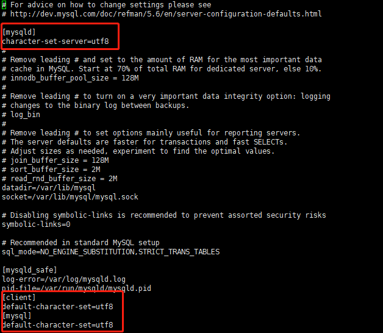

# microservice 微服务
 
#### JHipster微服务介绍


Jhipster通过使用NETFLX OSS(NETFLIX Open Source Software)+Spring boot Spring Cloud+Docker的技术实现微服务技术栈。<br/>
使用ELK(elastic search+ logstash + kibana)实现日志收集、处理、可视化。<br/>
微服务部分可拆件为以下部分：<br/>

注册中心<br/>
Jhipster可以使用 Jhipster Registry或者consul做为服务注册中心。<br/>

网关<br/>
当用户通过浏览器网站的时候首先经过网关，网关提供了用户访问的WEB APP，反向代理和权限管理功能，用户请求通过反向代理进入要具体的微服务中。<br/>

UAA<br/>
访问权限控制模块。<br/>

微服务<br/>
对外提供各种服务的微服务。<br/>

by[liuyatao](https://juejin.im/post/5b1c7f605188257d3a6973a0)

# 通过JDL创建JHipster项目
[官方中文文档](https://www.jhipster-cn.tech/jdl/)

#### 使用JDL工具
* 可以定义应用属性和实体
* 定义实体对象和属性和关联
* 定义JHipster的选项

[所有选项](https://www.jhipster-cn.tech/jdl/#annexes),
通常定义如下<br/>
```js
application {
    config {
        baseName myapp //app名称
        applicationType microservice //可选monolith
        prodDatabaseType mysql //生产环境数据库类型
        buildTool maven //可选gradle
        packageName	com.mycompany.myapp	
        authenticationType jwt//连接类型 jwt, session, uaa, oauth2
        databaseType sql
        devDatabaseType mysql //h2Disk 
        cacheProvider ehcache //缓存类型
        nativeLanguage zh-cn //en
        languages [zh-cn, en]
        serverPort 8180
    }
    entities *
}

entity UserOperation { //必须大写开头 采取驼峰规则
    userId String // 也可采用enum类型
}

entity Hello {
    world String
}
relationship OneToOne {
    UserOperation{userId} to Hello
}
dto * except Hello
service * with serviceClass
```

之后则可以
```jhipster import-jdl your-jdl-file.jdl```
如果是创建应用，则可在父文件夹下直接执行，可拼接多个JDL文件。<br/>
但是实际应用中遇到了问题：只有.jhipster/xx.json格式文件和一个.yo-sc.json文件生成。莫非是不能直接生成mono，只能直接生成microservice？

# 在JHipster中创建microservice项目

[参考创建流程blog](https://www.jdon.com/50161)

#### 单体应用架构和微服务应用架构的对比
* 单体应用架构：便于共享，易于测试和部署；复杂性高，扩展能力和创新能力受限，产生技术债务积累。
* 微服务架构：将一个应用程序开发为一组小型服务，每个服务运行在自己的进程中，服务间采用轻量级通信机制。单个服务启动较快，技术栈不受限制；运维要求高，分布式复杂，接口调整成本高（微服务采用接口进行通信）。
  
微服务开发技术点：
1. 服务注册、发现、负载均衡、容错（服务注册中心兼配置中心）
2. 服务之间的通信（消息模式，RPC模式）
3. api网关（路由，监控，安全认证，日志，限流）
4. 微服务周边设施（日志中心，监控中心，文档自动生成）

JHipster以以下方式工作微服务架构（目前并不清楚到底是怎么架构的）：
1. [gateway](https://www.jhipster-cn.tech/api-gateway/)（网关）由JHipster生成，处理网络流量，为一个Angular应用服务，可以存在多个网关。
2. [Traefik](https://www.jhipster-cn.tech/traefik/)，是一个现代化的 HTTP 反向代理及负载均衡器，它可以和网关集成工作。
3. [JHipster Registry](https://www.jhipster-cn.tech/jhipster-registry/) 是一个所有应用注册和配置中心。它还能提供运行时监控仪表盘。
Consul 是一个服务发现提供者，使用键/值对存储。它可以作为 JHipster Registry 的替代。
4. [JHipster UAA](https://www.jhipster-cn.tech/using-uaa/) 是一个 JHipster 构建的 User 认证和鉴权中心，使用 OAuth2 协议。
5. [Microservices](https://www.jhipster-cn.tech/creating-microservices/) 是指一堆用 JHipster 构建的应用（使用应用类型：microservice application），它们处理 REST 请求。它们都是无状态的，以及它们中的一些可以被运行为多个实例来应对高负载。
6. [JHipster Console](https://github.com/jhipster/jhipster-console) 是一个监控和告警控制台，使用 ELK 架构。


jhipster启动流程：
1. 启动jhipster-registry（服务和网关依赖注册中心，）
2. 启动jhipster-console（控制台，优先启动于具体服务）
3. 启动具体服务（每个微服务模块）
4. 启动网关（gateway项目类型，基于angular的前端）

#### 安装新的依赖
需要安装docker，docker-compose<br/>
[在centos7上配置docker](https://www.runoob.com/docker/centos-docker-install.html)
[在centos7上配置docker-compose](https://www.centos.bz/2019/01/centos7-%E5%AE%89%E8%A3%85-docker-%E5%92%8C-docker-compose/)
[centos7上配置docker的proxy](https://my.oschina.net/tinkercloud/blog/638960)

#### docker和docker-compose（待学习）
[docker&docker-compose](https://www.jhipster-cn.tech/docker-compose/)  
绕不过docker这个东西了看来。docker好像是用于生成一个稳定的软件环境。  
以前在实验室pull镜像没什么问题，出来以后pull镜像出现timeout问题，然后才知道以前有人说，docker网站不稳定是真的.  
从如下两篇中找到了解决方法。  
第一篇文章中，讲了如何各个系统中如何修改docker配置的。  
链接如下：http://www.jianshu.com/p/9fce6e583669  
第二篇文章说明了国内各个仓库镜像的对比。  
同样附上链接：http://www.datastart.cn/tech/2016/09/28/docker-mirror.html

#### 创建流程
1. 创建JDL
2. docker container run jhipster-registry
3. jhipster import-jdl jdl-name.jdl
4. docker container run sql
5. 修改不同微服务中的config，对应相应的地址和口令
6. mvn -Pdev package打包之后nohup run

#### 遇到的bug

1. 数据库不能输入中文
    1. 修改/etc/my.cnf
    2. ALTER TABLE `test` DEFAULT CHARACTER SET utf8
    3. alter table testtb convert to charset utf8;


#### 资料总结
[别人遇到的关于登录和鉴权的bug](https://blog.csdn.net/qq_38288606/article/details/80137794)  
[之后可能会遇到的微服务之间的相互调用](https://stayhungrystayfoolish.github.io/JHipster-RequestBetweenService/)
[之后可能会用到扩张centos的swap空间](https://www.cnblogs.com/zdz8207/p/linux-centos-swap.html)

怎么会这样，技术栈难度直线上升的也太快咧。
已经做了的事：1. 了解JHipster上的微服务 2. 看到了最基础的UI创建方法
接下来想要做的事 1. 通过UI转化为jdl进行微服务创建 

怎么会这样，docker的网络和java编译是否有些过于不稳定咧
已经做了的事：1. 通过jdl创建JHipster上的微服务 2. 创建了uaa、gateway、service
接下来想做的事： 1. 继续学习jhipster的详细配置和不同模块，不同模块之间的相互调用 2. 总结之前的bug和知识点
                1. 继续学习spring和他的家族

